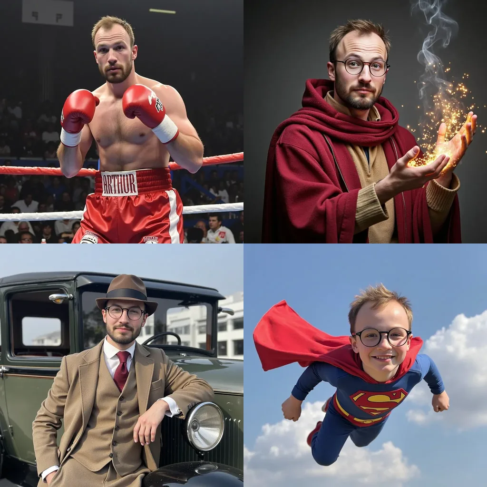

# FLUX LoRA Fine-Tuning

Fine-tune [Black Forest Labs FLUX](https://blackforestlabs.ai/) with LoRA for personalized image generation. Train the model to associate a specific trigger word with a person's appearance using just 30-50 photos.



The full story, with results and the math behind flow matching and LoRA, is in the write-up: [Teaching FLUX What I Look Like](https://www.arthurenard.me/blog/fluxtuning).

## Features

- **LoRA fine-tuning** with PyTorch Lightning (multi-GPU ready)
- **Aspect ratio bucketing** — images are automatically grouped by ratio and resized to optimal dimensions, preserving composition without cropping or distortion
- **Automatic captioning** using vision LLMs (Grok API)
- **Inference** via Diffusers or mflux (Apple Silicon optimized)
- **Checkpoint saving** and training resumption

## Quick Start

### Installation

```bash
# Clone the repository
git clone https://github.com/arthurenard/Fluxtuning.git
cd Fluxtuning

# Install dependencies (using uv)
uv sync

# Or with pip
pip install -e .
```

### Prepare Your Dataset

1. **Collect 30-50 photos** of your subject with variety in angles, lighting, and settings.
2. **Place images** in a folder (e.g., `original_images/`).
3. **Generate captions** using the captioning script:

```bash
# Set up your xAI API key
export XAI_API_KEY="your-api-key"

# Generate captions
uv run python -m src.cli.caption \
  --image-dir original_images \
  --subject "YourTriggerWord" \
  --reference reference.jpeg
```

For a better description of the captioning prompt, you can modify it in `src/captioning/caption_prompt.py`. See `data.example.json` for the expected format.

### Training

```bash
uv run python -m src.cli.finetune \
  --dataset data.json \
  --output_dir my_finetuning
```

- **`--dataset`**: Path to the JSON file containing captions and image IDs.
- **`--images`**: (Optional) Directory containing the raw images. Defaults to the same directory as the dataset JSON.
- **`--output_dir`**: Directory where checkpoints, samples, and processed images will be stored.

Training runs indefinitely by default. Monitor the loss and stop manually (Ctrl+C) when satisfied, or use the saved LoRA checkpoints from `--save_every_n_epochs` (default: 50). To limit training, use `--max_epochs N`.


### Sample Prompts

By default, no sample images are generated during training. You can specify prompts to monitor progress using the `--sample_prompts` argument:

```bash
uv run python -m src.cli.finetune \
  --dataset data.json \
  --sample_prompts "A photo of [subject]." "A portrait of [subject] wearing a suit."
```

### Inference

```bash
uv run python main.py \
  --lora_path my_finetuning/lora_epoch_500 \
  --prompt "A photo of YourTriggerWord wearing a spacesuit on Mars." \
  --num_images 3
```


## Project Structure

- `src/cli/` - Command-line interfaces for captioning and fine-tuning.
- `src/captioning/` - Logic for automatic image captioning.
- `src/finetuning/` - Core training logic, data modules, and callbacks.
- `main.py` - Main entry point for image generation (Diffusers).
- `mlx_main.py` - Inference optimized for Apple Silicon (mflux).

### Key Modules

- `src/finetuning/finetune_model.py`: Main LightningModule and training loop.
- `src/finetuning/data_utils.py`: Data loading, preprocessing, and training callbacks.
- `src/captioning/core.py`: Core logic for vision-based captioning.
- `src/captioning/caption_prompt.py`: Template for the captioning prompt.

## Technical Details

### Aspect Ratio Bucketing

Instead of forcing all images into a fixed square resolution (which causes cropping or distortion), this tool uses **aspect ratio bucketing**:

1. **Bucket Generation**: The system generates a set of resolution "buckets" (e.g., 1024×1024, 1216×832, 832×1216) that all have roughly the same total pixel area.
2. **Automatic Assignment**: Each image is assigned to the bucket that most closely matches its original aspect ratio.
3. **Lossless Resizing**: Images are resized to fit their bucket dimensions using high-quality Lanczos resampling—no cropping, no padding, no distortion.
4. **Batch Sampling**: During training, batches are constructed so that all images in a batch share the same dimensions, ensuring efficient GPU utilization.

Preprocessed images are cached in `preprocessed_images/` and reused across training runs.

See [HOWITWORKS.md](HOWITWORKS.md) for detailed mathematical documentation.
